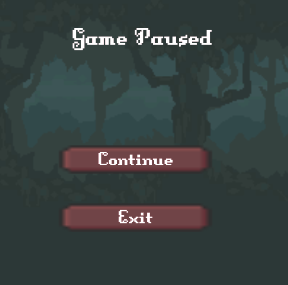
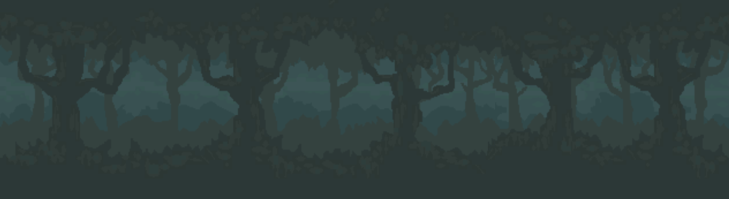

## Índice
- [1. Un poco de historia](#1-un-poco-de-historia)
- [2. Pantallas](#2-pantallas)
  - [2.1. Pantalla de título](#21-pantalla-de-título)
  - [2.2. El bosque](#22-el-bosque)
  - [2.3. Entrando en el castillo](#23-entrando-en-el-castillo)
  - [2.4. La torre](#24-la-torre)
  - [2.5. Pantalla de fin de partida](#25-pantalla-de-fin-de-partida)
- [3. Acciones del jugador](#3-acciones-del-jugador)
  - [3.1. Moverse](#31-moverse)
  - [3.2. Atacar cuerpo a cuerpo](#32-atacar-cuerpo-a-puerpo)
  - [3.3. Saltar](#33-saltar)
  - [3.4. Interactuar](#34-interactuar)
  - [3.5. Recoger objetos](#35-recoger-objetos)
  - [3.6. Esquivar](#36-esquivar)
- [4. Objetos](#4-objetos)
  - [4.1. Rubíes](#41-rubíes)
  - [4.2. Cofres](#42-cofres)
  - [4.3. Monedas de oro](#43-monedas-de-oro)
  - [4.4. Cajas de madera](#44-cajas-de-madera)
  - [4.5. Pociones de salud](#45-pociones-de-salud)
- [5. Enemigos](#5-enemigos)
  - [5.1. Esqueleto](#51-esqueleto) 
  - [5.2. Seta](#52-seta)
  - [5.3. Monstruo volador](#53-monstruo-volador)
  - [5.4. Goblin](#54-goblin)
- [6. Decisiones de diseño](#6-decisiones-de-diseño)
  - [6.1. Estilo de juego](#61-estilo-de-juego)
  - [6.2. Sistema de guardado](#62-sistema-de-guardado)
  - [6.3. UI de los coleccionables](#63-ui-de-los-coleccionables)
  - [6.4. Pantalla de pausa](#64-pantalla-de-pausa)
  - [6.5. Inteligencia artificial de los enemigos](#65-inteligencia-artifial-de-los-enemigos)
  - [6.6. Game manager](#66-game-manager)
  - [6.7. Sistema de salud](#67-sistema-de-salud)
  - [6.8. Sistema de combate del jugador](#68-sistema-de-combate-del-jugador)
  - [6.9. Interacción con los cofres](#69-interacción-con-los-cofres)
  - [6.10. Parallax](#610-parallax)
  - [6.11. "Efecto coyote"](#611-"efecto-coyote")
  - [6.12. Caída en los pinchos](#612-caída-en-los-pinchos)
  - [6.13. Cosas pendientes](#613-cosas-pendientes)
- [7. Recursos de terceros utilizados](#7-recursos-de-terceros-utilizados)

# 1. Un poco de historia
Desde el interior del bosque esta empezando a resurgir el mal. Los exploradores han determinado que el origen se encuentra dentro de un castillo en lo más profundo del bosque. Se ha formado un pequeño grupo para intentar acabar con este mal.
Dentro de este grupo se encuentra la protagonista, una gerrera experimentada.
En el interior del bosque el grupo sufre una emboscada y todos los miembros del grupo mueren, salvo nuestra protagonista que acaba gravemente herida. Ella sola tendrá que poner fin a este mal.

[Video con la demo](videos/VideoDemostracion.mp4)

# 2. Pantallas

## 2.1. Pantalla de Título

La pantalla inicial de la aventura. Aquí el jugador va a poder empezar una nueva partida. Si ha jugado préviamente tendrá disponible la opción de continuar su partida en el escenario donde lo había dejado. Finalmente podrá salir del juego, para esto se le pedirá que confirme su acción.

## 2.2. El Bosque

Este nivel es el tutorial de la aventura. Mediante una serie de retos sencillos se explica de forma visual e intuitiva al jugador las interacciones básicas que puede hacer durante la aventura. Las plataformas son sencillas y no presentan riesgo de muerte para el jugador.
## 2.3. Entrando en el Castillo

Empiezan a complicarse las cosas. Dentro del castillo hay más peligros y retos para el jugador. El número de enemigos es elevado y hay plataformas que pueden provocar la muerte del jugador.
## 2.4. La Torre

A llegado la hora de la verdad, en este escenario lucharemos con el goblin. Este actúa como jefe final de la aventura. Tiene más salud que los enemigos normales y alguna sorpresa más...

## 2.5. Pantalla de fin de Partida

En esta pantalla dependiendo del resultado de la partida se mostrará la victoria o la derrota del jugador y se le guiará hasta la pantalla principal.

# 3. Acciones del Jugador

## 3.1. Moverse
El jugador puede moverse por los ejes X e Y.

## 3.2. Atacar cuerpo a puerpo
Como su nombre indica es un ataque a corta distancia que puede realizar el jugador. Esta configurado por defecto con el botón izquierdo del ratón. En el momento de pulsarlo se mostrará la animación y se aplicarán sus efectos a los elementos cercanos. Hay un tiempo mínimo entre ataques para evitar que se abuse de esta acción.

## 3.3. Saltar
La habilidad básica de saltar esta limitada a que el personaje se encuentre en el suelo. No es posible saltar en el aire y tampoco es posible salar múltiples veces. Por defecto esta acción esta en la tecla Espacio.

## 3.4. Interactuar
Durante el transcurso de la aventura el jugador se irá encontrando cofres repartidos a lo largo de los niveles. Cuando el jugador esta lo suficientemente cerca de uno puede interactuar con el. Por defecto la tecla de interacción es la E.
Al hacerlo el cofre se abrirá y saldrá su contenido. En este caso son varias monedas de oro.

## 3.5. Recoger Objetos
En el juego hay ciertos objetos que el jugador puede recoger. Para hacer esta acción solo debe pasar por encima de ellos y su effecto se producirá.

## 3.6. Esquivar
Me hubiera gustado implementar un sistema de esquivar que durante la animación el jugador fuese invulnerable y pudiese atravesar a los enemigos. Al final se ha convertido en un dash que le permite moverse más rápido en un corto período de tiempo. Por defecto esta asignado al segundo botón del ratón.

# 4. Objetos
## 4.1. Rubíes

Esparcidos por el escenario se pueden encontrar estos rubíes. El jugador puede coleccionarlos. La idea original era tratar estos elementos como puntos de experiéncia para subir de nivel al jugador. Esta funcionalidad no se a implementado.

## 4.2. Cofres

Un cofre dorado y reluciente. El jugador puede interactuar con el para abrirlo y ver su contenido. En esta aventura soltará varias monedas de oro.
## 4.3. Monedas de Oro

Otro objeto colleccionable del juego. En un principio solo sirve para esto, coleccionar. Este objeto solo se puede obtener al interactuar con un cofre.

## 4.4. Cajas de Madera

Una caja de madera normal y corriente. El jugador puede atacar para romperla y ver su contenido. En nuestra aventura estas cajas siempre contienen una poción de salud para el jugador.

## 4.5. Pociones de Salud

Este objeto permite restaurar la salud del jugador en su totalidad. Solo es posible obtenerlo al romper las cajas de madera.

# 5. Enemigos

## 5.1. Esqueleto

El esqueleto es un enemigo que puede atacar al jugador pero no dispone de la capacidad de moverse. Su comportamiento es el siguiente:
- Mira si el jugador esta dentro del rango de acción.
- Movimiento nulo.
- Si el jugador entra dentro del rango de ataque espera el tiempo de la velocidad de su ataque y ataca.

## 5.2. Seta

La seta es un monstruo que no ataca al jugador directamente. Su comportamiento es el siguiente:
- Mira si el jugador esta dentro del rango de acción.
- Si esta dentro de este rango irá caminando hasta su posición.
- Cuando este lo suficientemente cerca del jugador le intentará tocar para provocarle daño.
- Si el juagor golpea a la seta esta se quedará quieda un pequeño interválo de tiempo.
## 5.3. Monstruo volador

El monstruo volador es una pequeña criatura voladora que tiene la capacidad de atacar al jugador directamente. Tiene el siguiente comportamiento:
- Mira si el jugador esta dentro del rango de acción.
- Si esta dentro de este rango irá caminando hasta su posición.
- Si el jugador entra dentro del rango de ataque espera el tiempo de la velocidad de su ataque y ataca.

## 5.4. Goblin

- Mira si el jugador esta dentro del rango de acción.
- Si esta dentro de este rango irá caminando hasta su posición.
- Si el jugador entra dentro del rango de ataque espera el tiempo de la velocidad de su ataque y ataca.

# 6. Decisiones de diseño
## 6.1. Estilo de Juego
He decidido hacer un juego más del tipo Castlevania. Me a parecido un reto más interesante y me da un abanico de posibilidades más grande que el Super Mario en 2D.

## 6.2. Sistema de guardado
Como la aventura dispone de tres niveles he decidido implementar un sistema de guardado automático. Para hacerlo simplemente he creado una clase con la información de la partida que sea serializable. Esta clase contiene la información básica de la partida:
>- Salud actual del jugador.
>- Salud máxima del jugador.
>- Nivel actual.
>- Monedas recogidas.
>- Rubíes recogidos.
Esta información se guarda en un fichero codificado con el BinaryFormatter (para que los listillos no hagan trampas y intenten modificar este fichero).
Al final de cada nivel se actualiza el nivel actual y se sobreescribe el fichero.
En la pantalla principal si el jugador dispone de un fichero de guardado la opción de continuar estará disponible, si hace clic podrá seguir desde EL PRINCIPIO DEL NIVEL.
En el caso de que el jugador quiera empezar una nueva partida se eliminará el fichero de guardado.
Finalmente si el jugador completa la aventura este fichero también se borrará.
Esto me ha permitido no tener que poner el Game Manager como un objeto que no se destruya al cargar la escena. De esta manera no me tengo que preocupar del estado en el que esta. En el momento en el que se crea ya carga la configuración y ya esta.

## 6.3. UI de los coleccionables

Un dolor de cabeza. En mi etapa de diseño del juego quedaba muy bien que cuando el jugador coja colleccionables aparezca el contador con animación y desaparezca en unos segundos. En la práctica ha sido complicado y he tenido que investigar varias cosas.
En primer lugar si quiero el objeto con su animación tengo que utilizar un GameObject, estos elementos no se pueden poner directamente sobre el canvas.
Por lo que he tenido que crear un canvas con una camara secundaria asociada que solo puede ver objetos de la capa UI. Por otro lado en la cámara principal he eliminado que pueda ver elementos de la capa UI.

## 6.4. Pantalla de pausa

Al estar ante un juego de plataformas me ha parecido interesante que tenga un sistema de pausa. He utilizado la tecla escape para realizar esta acción.
Además he querido dar al jugador la posibilad de terminar su sesión de juego añadiendo la opción de salir del nivel.
Aquí he tenido un problema, para la acción de salir del nivel he añadido la confirmación del jugador. Esto provocaba que dentro del menú de pausa si el jugador ha pulsado en el botón de salir y esta en el menú de confirmación se pusiera en marcha la partida y se quedaba el canvas de la confirmación de la salida. Para solucionar esto he añadido una variable para saber si estoy en la confirmación de salida. Si se da este caso al pulsar escape se sale de la confirmación y no de la pausa. Finalmente si se le vuelve a dar a escape el menú de pausa acabar y se reanuda la partida.
Para parar todos los objetos de la escena he puesto el timeScale a 0.
Finalmente como todo buen menú de pausa muestra el número de coleccionables que tiene el jugador.

## 6.5. Inteligencia artifial de los enemigos

Para la inteligencia artifial de los enemigos he definido las acciones que pueden realizar. En este caso son:
- Moverse.
- Atacar.
- Recibir daño.
- Morir.
Como todos van a tener estados parecidos he creado un controller de enemigo genérico y lo he heredado por cada enemigo. De esta manera, por ejemplo la seta tiene la acción de movimiento, pero no implementa el ataque, así no puede atacar. También me ha permitido ajustar parámetros dado que los enemigos tienen diferentes puntos de salud, rango de acción, velocidad de movimiento...
Para el sistema de animaciones lo mismo, pero en este caso he utilizado un OverrideController y substituído las animaciones de cada enemigo.

## 6.6. Game Manager
He decidido hacer una Game Manger con el patrón de diseño Singleton. Esto me permite no tener que preocuparme por tener que importar en todos los lugares este elemento y me ahorra hacer métodos estáticos dentro.
Con el sistema de guardado he eliminado la opción de hacer que el Game Manager no se destruya. Lo he hecho para tener que evitar pensar en que estado esta entre escenas. Sobre todo por las transiciones entre niveles de juego y el menú principal.
Además con el Singleton el resto de componentes lo tienen más fácil para realizar llamadas de métodos.
He intentado simplificar al máximo el Game Manager para que haga las mínimas cosas:
>- Controlar si la partida se ha terminado.
>- Controlar si el jugador ha superado el nivel.
>- Controlar si el jugador desea terminar la partida.
>- Controlar si la partida se tiene que pausar/reanudar.
>- Llevar la cuenta de los objetos coleccionables.
>- Actualizar interfaz de salud del jugador.
>- Cargar/Guardar la partida.

## 6.7. Sistema de salud

Para mostrar el sistema de salud tengo un array con la salud máxima del jugador para indicar el tamaño. En cada posición tengo un objeto con el sprite renderer.
En el momento en el que el jugador recive daño se actualiza toda la interfaz con el nuevo valor. Pasa lo mismo en el momento de coger una poción.

## 6.8. Sistema de combate del jugador
Para el sistema de combate he definido un punto de ataque en un extremo del jugador. Tomando esa posición de referencia utilizo el "OverlapCircleAll" para obtener todos los colliders dentro del rango de acción. Si es un enemigo le inflinjo daño.
Esto me ha dado un problema, podía espamear el ataque muy rápidamente y no cuadraba con la animación. Así que he añadido un timer para contar que el tiempo entre ataques sea de un segundo como mínimo.

## 6.9. Interacción con los cofres
Para interactuar con los cofres he reutilizado el sistema de ataque. Establezco un rango de interacción y miro si el jugador a pulsado la tecla de interacción. Seguidamente miro si de todos los objetos dentro del radio de acción hay alguno que sea interactuable.

## 6.10. Parallax

Me parecía chulo incluír este efecto en el primer nivel, en vez de tener un fondo estático que se va repitiendo. Para hacerlo he asociado un valor de a cada capa. Este valor lo utilizo a modo de offset. Las capas más cercanas tienen un valor más alto para dar la sensación de que se mueven más rápido.
Para que esto se repita indefinidamente tengo un valor mínimo, cuando llegan allí cambio la posición por la actual + offset de la última.

## 6.11. "Efecto coyote"
Al implementar el sistema de saltos algunas veces no he podido saltar, me daba la impresión de que el personaje estaba en el suelo pero no podía saltar o que podía saltar cuando ya no estaba en el suelo. Buscando por internet denominan a esto el "efecto coyote" haciendo referencia a los dibujos animados del coyote y el correcaminos.
Para solucionar esto he añadido una comprobación que mira si el jugador esta tocando el suelo. Se basa en coger una posición cercana a los pies del jugador y disparar un rayo hacía el suelo, si esta distancia es diferente de 0 entonces no estamos tocando el suelo.

## 6.12. Caída en los pinchos
En el nivel del castillo hay pinchos, estos elementos restan vida al jugador pero no lo matan directamente. Mi idea era que cuando cayera el jugador se le hiciera un punto de daño y se le devolviera a una posición cercana segura.
Para hacer esto voy guardando la última posición en la que el jugador esta en el suelo. Entonces en el momento de caer y devolver al jugador a un lugar seguro utilizo este valor. Esto me ha dado un problema, esta posición es muy cercana al borde y se caía por la gravedad. Para solucionar esto he añadido un offset a la posición dependiendo en la dirección en la que este mirando ese momento (para evitar que este offset nos deje encima de los pinchos).

## 6.13. Cosas pendientes
He querido hacer un mix de tantas cosas que no todo a salido como tenía planeado:
- Falta revisar la interfaz de recolectables a veces si se cogen varias monedas/gemas seguidas la animación salta otra vez.
- El sistema de salto es un poco astronauta, me ha faltado ajustar valores para ir incrementando la velocidad de caída a medida que pasa más tiempo sin pisar el suelo.
- El sistema de combate se tiene que afinar más, alguna vez hace alguna cosa rara.
- En el nivel del castillo, la parte de ascensión final tenía planeado que fuese a contrareloj en la que un veneno iba subiendo y el jugador tiene que subir deprisa.
- El jefe final no tiene habilidades de jefe final!!.

# 7. Recursos de terceros utilizados

- Sprites del Castillo: <a href="https://blackspirestudio.itch.io/medieval-pixel-art-asset-free" target="_blank">Medieval pixel art</a>, by BlackPire Studio.
- Sprites del cofre: <a href="https://admurin.itch.io/free-chest-animations" target="_blank">Free Chest Animations</a>, by Admurin.
- Srites de las monedas y rubíes: <a href="https://laredgames.itch.io/gems-coins-free" target="_blank">Gems/Coins</a>, by La Red Games.
- Sprites de los enemigos: <a href="https://luizmelo.itch.io/monsters-creatures-fantasy" target="_blank">Monsters Creatures Fantasy</a>, by Luiz Melo.
- Sprites del jugador: <a href="https://clembod.itch.io/warrior-free-animation-set" target="_blank">Warrior Free Animation Set</a>, by Clembod.
- Sprites del sistema de salud: <a href="https://fliflifly.itch.io/hearts-and-health-bar" target="_blank">Hearths and Health Bar</a>, by Vampire Girl.
- Sprite de la poción: <a href="https://cheekyinkling.itch.io/shikashis-fantasy-icons-pack" target="_blank">shikashis fantasy icons pack</a>, by Cheekyinkling.
- Temas musicales: <a href="https://svl.itch.io/rpg-music-pack-svl" target="_blank">RPG Music Pack</a>, by SVL.
- Sprites de la pantalla de incio: <a href="https://brullov.itch.io/2d-platformer-asset-pack-castle-of-despair" target="_blank">2D Platformer Asset Pack</a>, by Brullov.
- Sprites de la caja: <a href="https://blackdragon1727.itch.io/items-and-traps-16x16-pixel" target="_blank">Items And Traps</a>, by BlackDragon1727.
- Sprites del bosque: <a href="https://szadiart.itch.io/platformer-fantasy-set1" target="_blank">Platformer Fantasy Set1</a>, by Szadiart.
- Sprites de la barra de salud del Jefe: <a href="https://www.pixilart.com/draw/health-bar-sprite-sheet-04dbaae0250b710" target="_blank">Health Bar Sprite Sheet</a>, by Desconocido.
- Sprites de la pantalla de fin de partida: <a href="https://aethrall.itch.io/demon-woods-parallax-background" target="_blank">Demon Woods Parallax Background</a>, by Aethrall.
- <a href="https://mixkit.co/free-sound-effects/sword/" target="_blank">Clip de audio de espada</a>
- Clips de audio: <a href="https://www.dreamstime.com/stock-music-sound-effect/collect-jewel-03.html">Collect Jewel</a>